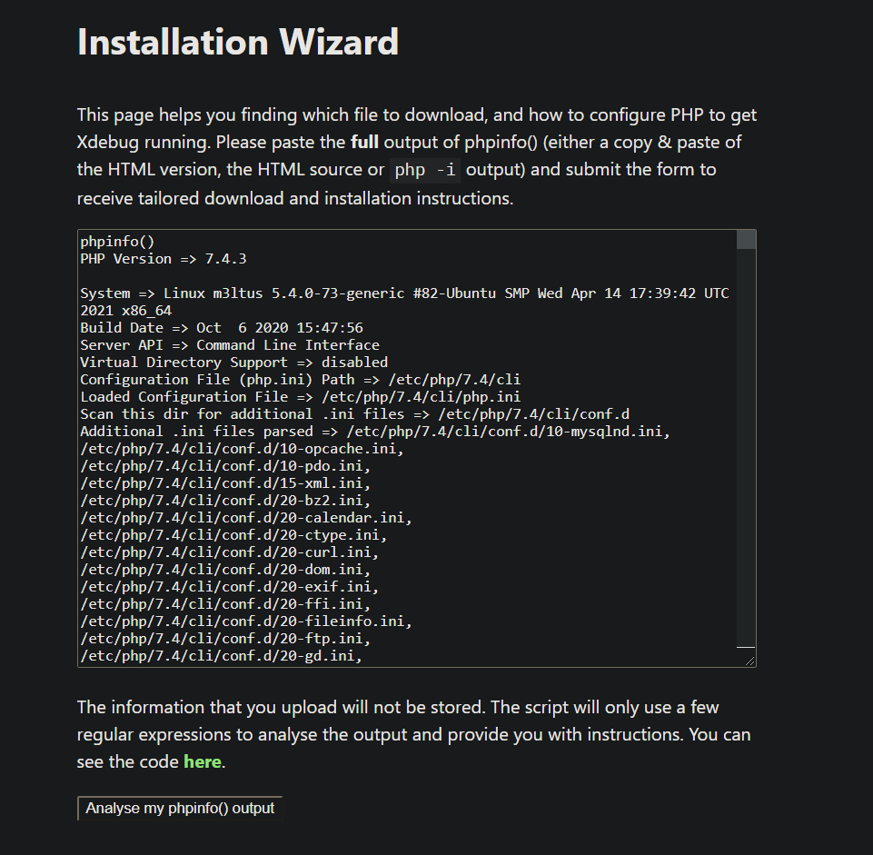
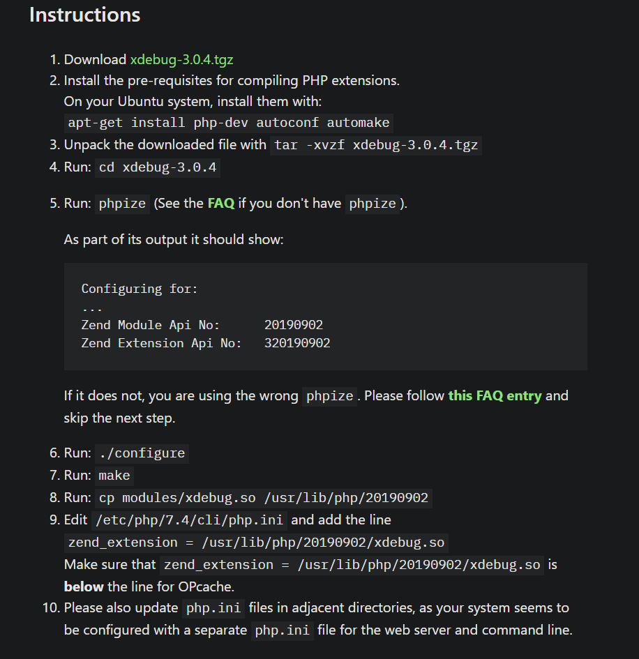
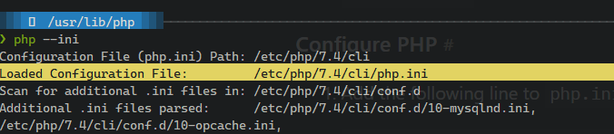
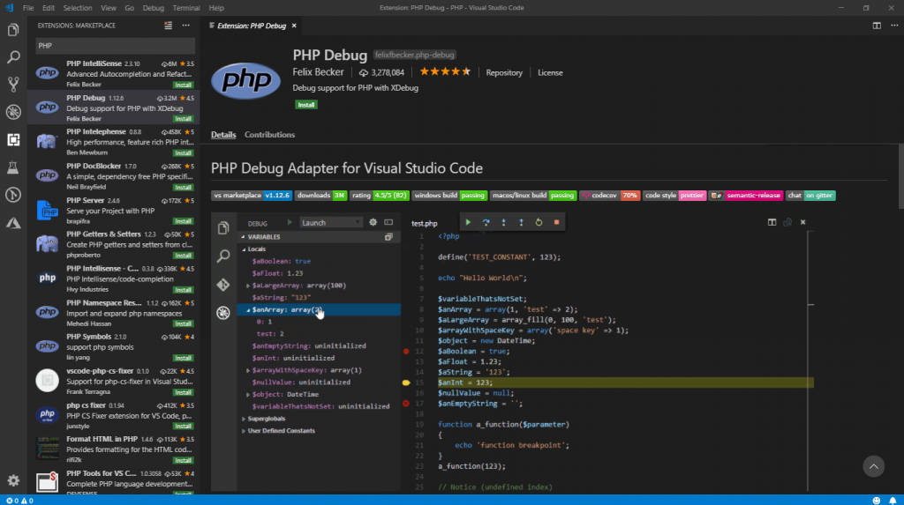
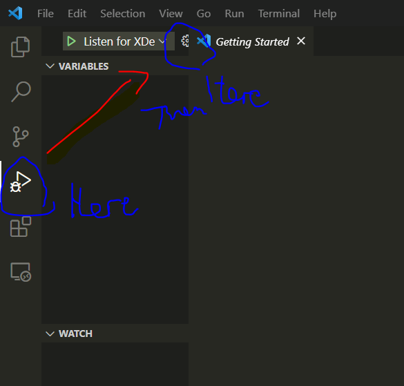
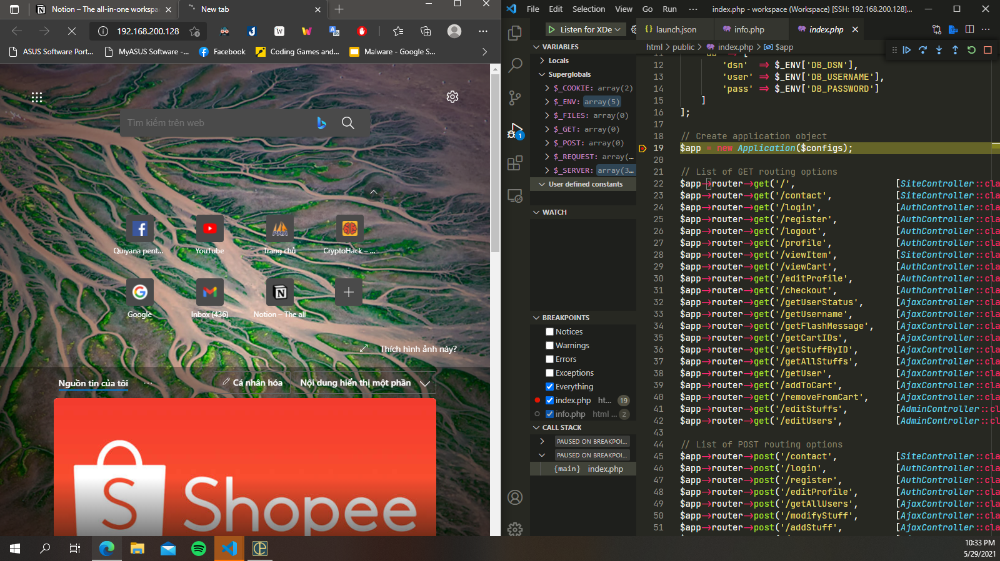

#  Setup XDebug

## Setup for server
This setup is for Ubuntu users.

<b>Step 1</b>: Run the following command.
```
    php -i  
```
<b>Step 2</b>: Navigate to https://xdebug.org/wizard and paste the full output of the previous command to the website. Press "analyse my phpinfo() output".



<b>Step 3</b>: Do whatever that website tells you to do. \
(READ NOTE BELOW FIRST)


<b>NOTE: FOR SOME REASON I EDIT THE FILE /etc/php7.4/fpm/php.ini INSTEAD OF ~~/etc/php/7.4/cli/php.ini~~ AND IT WORKS. DON'T EDIT THE CLI FILE. FIND THAT FILE VIA COMMAND: </B>
```
    php --ini
```
<b>AND GET THE RESULT FROM THIS: </b>



<b>Step 4</b>: Also add the following to the specified <i>php.ini</i> file mentioned above.
```
xdebug.remote_enable = 1
xdebug.remote_autostart = 1
xdebug.mode = debug
xdebug.start_with_request = yes
xdebug.client_port = <portNumber>
xdebug.debug_log = <logFile>
```

Replace <b>\<portNumber\></b> with any port in your favor. I set it to 9001.

Replace <b>\<logFile\></b> with the name of the Xdebug log file. I set it to '/tmp/xdebug.log'

## Setup for VSCode
In order to use the features of Xdebug, I use the features presented by an extension in VSCode, PHP Debug.



After install this extension, click:


Which opens a <i>launch.json</i> file, I set this to the file:
```
{
    "version": "0.2.0",
    "configurations": [
        {
            "name": "Listen for XDebug",
            "type": "php",
            "request": "launch",
            "port": <portNumber>,
        },
        {
            "name": "Launch currently open script",
            "type": "php",
            "request": "launch",
            "program": "${file}",
            "cwd": "${fileDirname}",
            "port": <portNumber>
        }
    ]
}
```
where the <b>\<portNumber\></b> is the number I used for the server (9001). Restart nginx server using:
```
    service nginx restart
    service php7.4-fpm restart
    nginx -s reload
```

# Check log

Now, try to set a breakpoint to a code and we get:



<p align='middle'>Breakpoint hit when we visit the website.</p>

Since I set the log file to /tmp/xdebug.log, I only need to view the file using:
```
    cat <logFile> # <---- (/tmp/xdebug.log)
```

And here is the result:

<i>/tmp/xdebug.log:</i>

```
[9884] Log opened at 2021-05-29 15:42:28.337688
[9884] [Step Debug] INFO: Connecting to configured address/port: localhost:9001.
[9884] [Step Debug] INFO: Connected to debugging client: localhost:9001 (through xdebug.client_host/xdebug.client_port). :-)
[9884] [Step Debug] -> <init xmlns="urn:debugger_protocol_v1" xmlns:xdebug="https://xdebug.org/dbgp/xdebug" fileuri="file:///var/www/html/public/index.php" language="PHP" xdebug:language_version="7.4.3" protocol_version="1.0" appid="9884"><engine version="3.0.4"><![CDATA[Xdebug]]></engine><author><![CDATA[Derick Rethans]]></author><url><![CDATA[https://xdebug.org]]></url><copyright><![CDATA[Copyright (c) 2002-2021 by Derick Rethans]]></copyright></init>

[9884] [Step Debug] <- feature_get -i 1 -n resolved_breakpoints
[9884] [Step Debug] -> <response xmlns="urn:debugger_protocol_v1" xmlns:xdebug="https://xdebug.org/dbgp/xdebug" command="feature_get" transaction_id="1" feature_name="resolved_breakpoints" supported="1"><![CDATA[0]]></response>

[9884] [Step Debug] <- feature_set -i 2 -n resolved_breakpoints -v 1
[9884] [Step Debug] -> <response xmlns="urn:debugger_protocol_v1" xmlns:xdebug="https://xdebug.org/dbgp/xdebug" command="feature_set" transaction_id="2" feature="resolved_breakpoints" success="1"></response>

[9884] [Step Debug] <- feature_get -i 3 -n notify_ok
[9884] [Step Debug] -> <response xmlns="urn:debugger_protocol_v1" xmlns:xdebug="https://xdebug.org/dbgp/xdebug" command="feature_get" transaction_id="3" feature_name="notify_ok" supported="1"><![CDATA[0]]></response>

[9884] [Step Debug] <- feature_set -i 4 -n notify_ok -v 1
[9884] [Step Debug] -> <response xmlns="urn:debugger_protocol_v1" xmlns:xdebug="https://xdebug.org/dbgp/xdebug" command="feature_set" transaction_id="4" feature="notify_ok" success="1"></response>

[9884] [Step Debug] <- breakpoint_set -i 5 -t line -f file:///var/www/html/public/index.php -n 19
[9884] [Step Debug] -> <notify xmlns="urn:debugger_protocol_v1" xmlns:xdebug="https://xdebug.org/dbgp/xdebug" name="breakpoint_resolved"><breakpoint type="line" resolved="resolved" filename="file:///var/www/html/public/index.php" lineno="19" state="enabled" hit_count="0" hit_value="0" id="98840001"></breakpoint></notify>

[9884] [Step Debug] -> <response xmlns="urn:debugger_protocol_v1" xmlns:xdebug="https://xdebug.org/dbgp/xdebug" command="breakpoint_set" transaction_id="5" id="98840001" resolved="resolved"></response>

[9884] [Step Debug] <- breakpoint_get -i 6 -d 98840001
[9884] [Step Debug] -> <response xmlns="urn:debugger_protocol_v1" xmlns:xdebug="https://xdebug.org/dbgp/xdebug" command="breakpoint_get" transaction_id="6"><breakpoint type="line" resolved="resolved" filename="file:///var/www/html/public/index.php" lineno="19" state="enabled" hit_count="0" hit_value="0" id="98840001"></breakpoint></response>

[9884] [Step Debug] <- breakpoint_set -i 7 -t line -f file:///var/www/html/public/info.php -n 2
[9884] [Step Debug] -> <response xmlns="urn:debugger_protocol_v1" xmlns:xdebug="https://xdebug.org/dbgp/xdebug" command="breakpoint_set" transaction_id="7" id="98840002" resolved="unresolved"></response>

[9884] [Step Debug] <- breakpoint_set -i 8 -t exception -x *
[9884] [Step Debug] -> <response xmlns="urn:debugger_protocol_v1" xmlns:xdebug="https://xdebug.org/dbgp/xdebug" command="breakpoint_set" transaction_id="8" id="98840003" resolved="resolved"></response>

[9884] [Step Debug] <- run -i 9
[9884] [Step Debug] -> <response xmlns="urn:debugger_protocol_v1" xmlns:xdebug="https://xdebug.org/dbgp/xdebug" command="run" transaction_id="9" status="break" reason="ok"><xdebug:message filename="file:///var/www/html/public/index.php" lineno="19"></xdebug:message></response>

[9884] [Step Debug] <- stack_get -i 10
[9884] [Step Debug] -> <response xmlns="urn:debugger_protocol_v1" xmlns:xdebug="https://xdebug.org/dbgp/xdebug" command="stack_get" transaction_id="10"><stack where="{main}" level="0" type="file" filename="file:///var/www/html/public/index.php" lineno="19"></stack></response>

[9884] [Step Debug] <- stack_get -i 11
[9884] [Step Debug] -> <response xmlns="urn:debugger_protocol_v1" xmlns:xdebug="https://xdebug.org/dbgp/xdebug" command="stack_get" transaction_id="11"><stack where="{main}" level="0" type="file" filename="file:///var/www/html/public/index.php" lineno="19"></stack></response>

[9884] [Step Debug] <- context_names -i 12 -d 0
[9884] [Step Debug] -> <response xmlns="urn:debugger_protocol_v1" xmlns:xdebug="https://xdebug.org/dbgp/xdebug" command="context_names" transaction_id="12"><context name="Locals" id="0"></context><context name="Superglobals" id="1"></context><context name="User defined constants" id="2"></context></response>

[9884] [Step Debug] <- context_get -i 13 -d 0 -c 0
[9884] [Step Debug] -> <response xmlns="urn:debugger_protocol_v1" xmlns:xdebug="https://xdebug.org/dbgp/xdebug" command="context_get" transaction_id="13" context="0"><property name="$app" fullname="$app" type="uninitialized"></property><property name="$configs" fullname="$configs" type="array" children="1" numchildren="2" page="0" pagesize="32"><property name="rootdir" fullname="$configs[&quot;rootdir&quot;]" type="string" size="13" encoding="base64"><![CDATA[L3Zhci93d3cvaHRtbA==]]></property><property name="db" fullname="$co

```